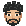

<p align="center">
  
</p>

# Muhammad Rayyan's portfolio

A personal portfolio for a full-stack developer based in Lahore. Selected projects, work experience, technical skills, a downloadable résumé, and an arcade of two 3D games, built with HTML, CSS, and vanilla JavaScript.

[Visit the website](https://www.rayyandev.tech/) · [View the résumé](MuhammadRayyan-Resume.pdf)

## What’s inside

- Project previews and expandable implementation notes for JournalPost, Usage Pill, and Imagenix.
- Responsive layouts, a paper-and-red palette, and typography from Google Fonts.
- A clickable SVG envelope that requests a draft in the visitor's email app, plus a Gmail compose link and a copy-email button.
- A transparent pixel-avatar favicon that blinks twice on arrival and when returning to the tab.
- Keyboard focus styles, a skip link, reduced-motion support, and print styles.
- An [arcade](https://www.rayyandev.tech/arcade/) with two Three.js games: a Rubik’s cube with a scramble button, timer, and best time, and chess against a bot with three levels.

The site has no framework, package manager, build step, backend, or environment variables. The arcade loads pinned copies of three.js and chess.js from `assets/vendor/` through import maps. Navigation, project details, résumé links, and email links work without JavaScript.

## Run locally

With Git and Python 3 installed:

```sh
git clone https://github.com/mrayyan911/muhammadrayyan.github.io.git
cd muhammadrayyan.github.io
python -m http.server 8000 --bind 127.0.0.1
```

Open [localhost:8000](http://localhost:8000). Edit the files and refresh the browser. Stop the server with `Ctrl+C`. On systems where Python is named `python3`, use that instead.

> [!TIP]
> Use a local HTTP server instead of opening `index.html` directly. Clipboard and service-worker behavior depend on the browser's secure-context support; localhost is suitable for development.

## Project structure

| File | Purpose |
| --- | --- |
| [index.html](index.html) | Page content, links, metadata, and inline SVG artwork |
| [assets/portfolio.css](assets/portfolio.css) | Design tokens, layouts, interaction states, and responsive styles |
| [assets/portfolio.js](assets/portfolio.js) | Copyright year, email copying, and service-worker registration |
| [assets/favicon.js](assets/favicon.js) | Favicon frame switching and motion preferences |
| [assets/](assets/) | Portraits, project images, and generated icons |
| [scripts/build_favicon.py](scripts/build_favicon.py) | Pixel-avatar source and icon generator |
| [scripts/build_resume.py](scripts/build_resume.py) | Résumé content and PDF generator |
| [arcade/](arcade/) | Arcade index and the cube and chess pages |
| [assets/arcade/](assets/arcade/) | Arcade styles, shared 3D stage, game logic, views, and the chess bot |
| [assets/vendor/](assets/vendor/) | Pinned three.js and chess.js builds, with their licenses |
| [scripts/vendor_libs.py](scripts/vendor_libs.py) | Downloads the pinned libraries into `assets/vendor/` |
| [tests/](tests/) | Node tests for the cube logic and the chess bot |
| [sw.js](sw.js) | Image and library caching, and cache-version cleanup |
| [CNAME](CNAME), [robots.txt](robots.txt), [sitemap.xml](sitemap.xml) | Custom domain and search-engine metadata |

## Update the site

Edit content and project links in `index.html`. Colors, fonts, and spacing variables live at the start of `assets/portfolio.css`. The fonts are DM Sans, Instrument Serif, DM Mono, and Space Grotesk for numbering; system fallbacks are defined in CSS.

When changing the email address, update `index.html`, the clipboard value in `assets/portfolio.js`, and the résumé source. When changing the domain, update `CNAME`, the canonical and Open Graph URLs in `index.html`, `robots.txt`, `sitemap.xml`, and the résumé source.

### Pixel avatar

Edit the palette and pixel rectangles in `scripts/build_favicon.py`, then run:

```sh
python scripts/build_favicon.py
```

This uses only Python's standard library and regenerates four files in `assets/`:

- `favicon.svg`: scalable static portrait.
- `favicon-avatar.png`: 32 × 32 transparent favicon.
- `favicon-avatar-blink.png`: matching closed-eye frame.
- `apple-touch-icon.png`: 180 × 180 home-screen icon.

The blink script stops animation in hidden tabs and for reduced-motion preferences. Browsers control how favicon updates appear; the static portrait remains the fallback. After changing icons, increment the icon URL version in `index.html`; the blink frame inherits that version automatically.

### Résumé

Edit `scripts/build_resume.py`, then install its optional dependency and regenerate the PDF:

```sh
python -m pip install reportlab
python scripts/build_resume.py
```

This overwrites `MuhammadRayyan-Resume.pdf`. ReportLab is needed only for PDF generation, not for running the website.

### Arcade

Each game page renders into one canvas with a shared stage (`assets/arcade/core/stage.js`) that draws frames only while something moves. The cube is three instanced meshes; its turn logic in `assets/arcade/cube/model.js` uses integer state and has no three.js dependency. Chess rules come from chess.js; the bot in `assets/arcade/chess/engine.worker.js` runs an alpha-beta search in a Web Worker.

To upgrade a library, change its version in `scripts/vendor_libs.py`, run `python scripts/vendor_libs.py`, and update the import-map paths in the three `arcade/**/index.html` files and the chess.js import in `assets/arcade/chess/engine.worker.js` and `book.js`. To regenerate the preview posters, see [scripts/capture_posters.md](scripts/capture_posters.md).

## Publish and caching

Serve the repository root with a static host such as GitHub Pages. The publish directory contains `index.html`, `assets/`, `sw.js`, and the résumé PDF; there is no build command. `CNAME` specifies `www.rayyandev.tech`. Hosting and DNS settings are managed outside this repository.

The service worker caches same-origin PNG, WebP, and SVG assets, and the versioned libraries in `assets/vendor/`, only as they are requested; it does not download unused portrait sizes during installation. HTML, CSS, the site's own JavaScript, and the résumé use the network. This is image caching, not a fully offline site.

> [!NOTE]
> When replacing an image at the same URL, increment `CACHE` in `sw.js` so returning visitors receive the new asset. For local debugging, clear site storage or unregister the service worker if an old image persists.

## Search and AI discovery

The homepage and each arcade page include unique titles and descriptions, canonical URLs, Open Graph and Twitter metadata, and JSON-LD. The homepage describes the website and its owner; the arcade pages describe the game collection and individual games. Keep these aligned with the visible biography when editing the page.

`robots.txt` permits crawling and points to `sitemap.xml`. The sitemap lists the canonical homepage, arcade directory, cube game, and chess game; update its `lastmod` date after meaningful page changes. `llms.txt` provides a short profile, project directory, and arcade links for AI tools. It is not a search-ranking mechanism.

The `profile-*.webp` files are actual resized exports of `assets/profile.webp`. Preserve their declared widths when regenerating them, and keep HTML image dimensions and social-image metadata in sync.

## Check changes

There is no build pipeline. If Node.js is available, run the arcade tests and check JavaScript syntax with:

```sh
node --test tests/*.test.mjs
node --check assets/portfolio.js
node --check assets/favicon.js
node --check sw.js
git diff --check
```
